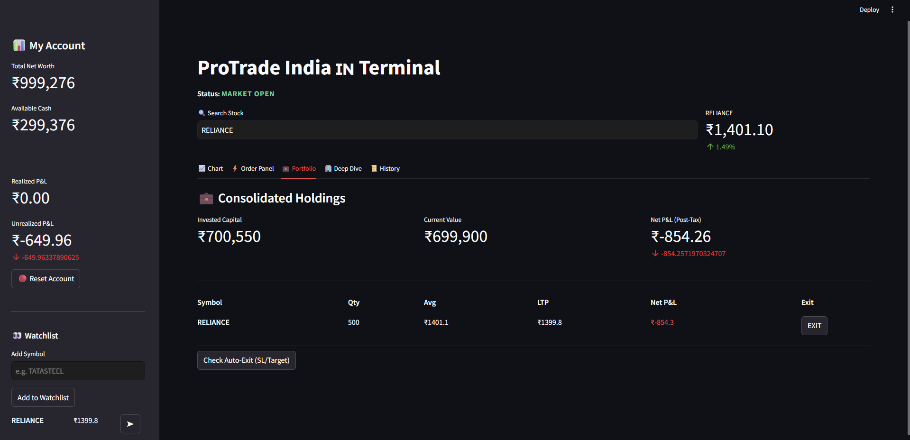

# 📈 ProTrade India | Ultimate Paper Trading Dashboard


-orange)

**ProTrade India** is a professional-grade paper trading simulator designed for the Indian Stock Market (NSE). Built with **Streamlit** and **Python**, it offers a realistic trading environment with real-time data, technical analysis tools, tax estimations, and strict market-hour enforcement.

Perfect for students, beginners, and traders looking to backtest strategies without risking real capital.

---

## ✨ Key Features

### 📊 Advanced Analytics
- **Live Charts:** Interactive Candlestick charts powered by Plotly.
- **Technical Indicators:** Real-time calculation of **RSI (14)**, **SMA (50)**, and **EMA (20)**.
- **Market Depth:** Displays Open, High, Low, and Previous Close data.

### ⚡ Realistic Order Execution
- **Order Types:** Market, Limit, Intraday (MIS), and Delivery (CNC).
- **Market Hours Logic:** Enforces NSE trading hours (09:15 – 15:30 IST).
- **Queue System:** Orders placed after market close are queued and auto-executed when the market opens.
- **Smart Exits (GTT):** Set **Stop Loss** and **Target** prices that trigger auto-exits in the background.

### 💼 Portfolio Management
- **Consolidated View:** Merges multiple buy orders for the same stock into a weighted average price.
- **P&L Tracking:** Real-time tracking of **Unrealized** vs. **Realized** Profit & Loss.
- **Tax Estimator:** auto-calculates STT, Brokerage, and GST to show realistic "Post-Tax" profits.

---

## 🛠️ Installation

Follow these steps to set up the project locally.

### 1. Clone the Repository
```bash
git clone https://github.com/shivansh4123/paper-trading.git
cd paper-trading

```

### 2. Create a Virtual Environment (Optional but Recommended)

```bash
# Windows
python -m venv venv
.\venv\Scripts\activate

# Mac/Linux
python3 -m venv venv
source venv/bin/activate

```

### 3. Install Dependencies

```bash
pip install -r requirements.txt

```

### 4. Run the Application

```bash
streamlit run main.py

```

---

## 📦 Dependencies

Create a `requirements.txt` file with the following libraries:

```text
streamlit
yfinance
pandas
plotly
numpy
pytz

```

---

## 🖥️ Usage Guide

1. **Search:** Use the search bar at the top to find a stock (e.g., "HDFC Bank").
2. **Analyze:** Review the candlestick chart and check the RSI/SMA indicators.
3. **Trade:**
* Go to the **"⚡ Order Panel"** tab.
* Select Action (Buy/Sell), Quantity, and Product type.
* (Optional) Set a Limit Price, Stop Loss, or Target.
* Click **Place Order**.


4. **Monitor:** Switch to the **"💼 Portfolio"** tab to see your active positions and P&L.
5. **Market Status:** The app automatically detects if the NSE market is Open or Closed.

---

## 📸 Screenshots




---

## 🤝 Contributing

Contributions are welcome!

1. Fork the Project.
2. Create your Feature Branch (`git checkout -b feature/AmazingFeature`).
3. Commit your Changes (`git commit -m 'Add some AmazingFeature'`).
4. Push to the Branch (`git push origin feature/AmazingFeature`).
5. Open a Pull Request.

---

## ⚠️ Disclaimer

This application is for **educational purposes only**.

* The prices are fetched via `yfinance` and may have a slight delay.
* Tax calculations are estimates based on standard discount broker rates.

---

## 📄 License

Distributed under the MIT License. See `LICENSE` for more information.

---

Made with 🧠 by 😎

```

```
